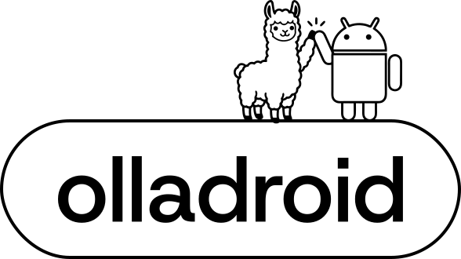
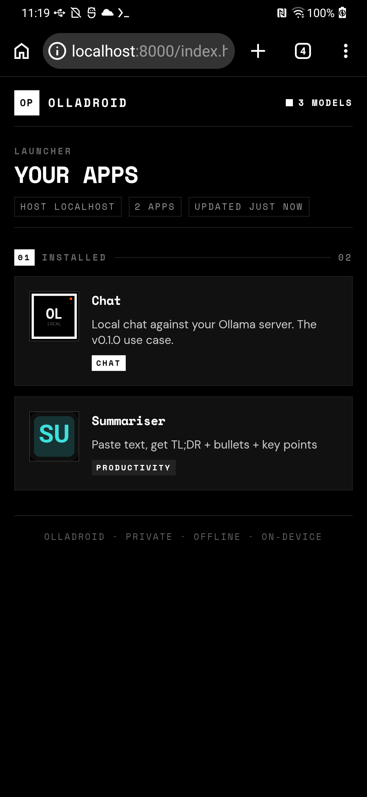
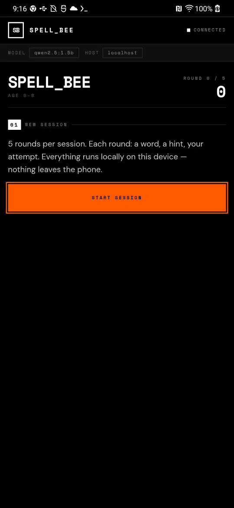
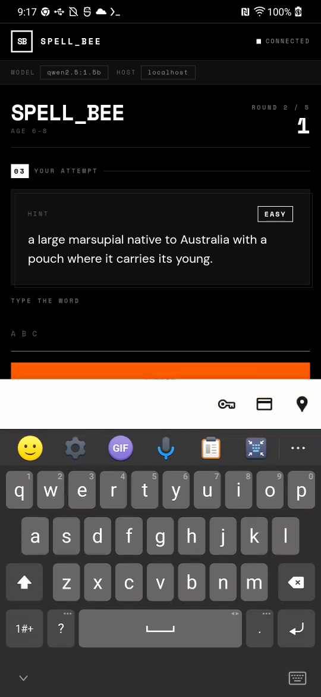
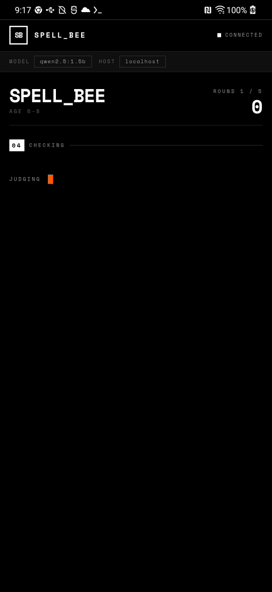
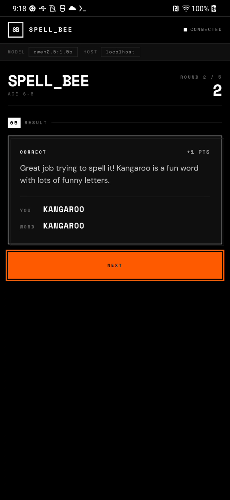
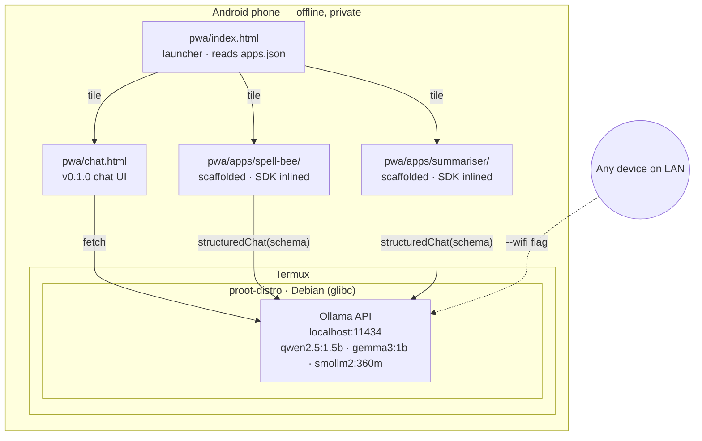

# olladroid

<p align="center">
  <picture>
    <source media="(prefers-color-scheme: dark)" srcset="pwa/logo-dark.svg">
    
  </picture>
</p>

[](https://github.com/s1dd4rth/olladroid/actions/workflows/ci.yml)

**The AI app framework that fits in one phone — offline, private, yours.**

olladroid is a framework for building personalised AI mini-apps that run
entirely on a phone you already own. Scaffold an app in one command, inline a
tiny SDK, talk to a local LLM via structured JSON. No cloud, no account, no
data leaving the device. Your phone becomes a private AI runtime that you
program.

[**Build your first mini-app →**](https://s1dd4rth.github.io/olladroid/building-apps)

It also ships a one-line installer that turns any old Android phone into a
local AI server using [Ollama](https://ollama.com), [Termux](https://termux.dev),
and a built-in PWA chat UI — the original v0.1.0 use case is unchanged and
still one command away.

[**Read the full guide →**](https://s1dd4rth.github.io/olladroid)

## Quick Start

**In Termux on your phone** — one line:

```bash
curl -fsSL https://s1dd4rth.github.io/olladroid/install.sh | bash
```

That's it. The installer pins a known-good Termux mirror, clones the repo
to `~/olladroid`, installs Debian inside `proot-distro`, installs
Ollama, and copies the PWA chat UI to `/sdcard/olladroid/pwa/`. When
it finishes it prints the exact command to start the server.

Then:

```bash
# Pull a model (pick one that fits your RAM — see table below)
proot-distro login debian -- ollama pull qwen2.5:1.5b

# Start the server + PWA launcher (opens Chrome at http://localhost:8000/)
# The launcher lists the chat UI and every mini-app you've scaffolded.
bash ~/olladroid/scripts/start-ollama.sh --wifi --chat
```

**Prefer to inspect before you run?** The `curl | bash` one-liner is
convenient but blindly trusts the install script. If you'd rather read it
first, clone the repo manually:

```bash
pkg install -y git
git clone https://github.com/s1dd4rth/olladroid
cd olladroid
less scripts/install-ollama.sh      # read it
bash scripts/install-ollama.sh      # run it
```

The last command starts Ollama on the LAN, serves the PWA over
`http://localhost:8000`, and launches Chrome pointed at the chat UI. Press
**Ctrl+C** in Termux to stop everything cleanly.

Once the chat UI is open, use Chrome's overflow menu → **Install app** (or
**Add to Home Screen**) to install it as a standalone PWA with real offline
support.

**Optional: debloat your phone first** (requires a PC with ADB to free ~1 GB
of RAM by removing bloatware). Do this **before** the Termux steps above:

```bash
# On your PC, with phone connected via USB and USB debugging enabled
git clone https://github.com/s1dd4rth/olladroid
cd olladroid

# Always start with --dry-run to preview what would be removed on your phone
./scripts/debloat.sh --dry-run

# If it looks sane, run for real
./scripts/debloat.sh

# Or write a JSON report alongside — useful for auditing, or for contributing
# a new vendor list
./scripts/debloat.sh --dry-run --save-report /tmp/debloat.json
```

`debloat.sh` auto-detects your phone's manufacturer via ADB (`LGE`, `Samsung`,
`Xiaomi`, `Google`, …) and loads the matching manifest from `debloat/`. If no
manifest exists for your OEM yet, you'll see a warning — see
[`debloat/README.md`](debloat/README.md) for how to contribute one (usually
one PR, one file). Opt-in category bundles for social apps, preloaded games,
and Google first-party apps load by default; toggle with `--category`,
`--no-categories`, or `--skip-categories google-apps`.

### One launcher, many apps

The Quick Start installs the whole PWA tree under `pwa/`. When you run
`scripts/start-ollama.sh --chat`, Chrome opens the **launcher** at
`http://localhost:8000/` — a TE-styled tile grid that lists the v0.1.0 chat
UI plus every mini-app you've scaffolded under `pwa/apps/<slug>/`. Tap a
tile; you land in the app. That's it.

1. **Use your phone as a local AI server.** The chat tile gives you the
   v0.1.0 use case — a clean chat UI over `http://localhost:11434`, plus
   any device on your LAN when you pass `--wifi`. Unchanged since v0.1.0.
   Skip to [How It Works](#how-it-works).
2. **Scaffold your own AI mini-app.** Run `node cli/new.js` and the
   scaffolder walks you through a slug, a template (Spell Bee or
   Summariser today), a model, and a host. It writes a self-contained
   offline-first AI app into `pwa/apps/<slug>/`, inlines the ~20 KB SDK,
   registers the app in `pwa/apps.json`, and the launcher picks up the new
   tile the next time you open it. Jump to [Building Apps](#building-apps)
   for the full flow, the [Spell Bee reference](examples/spell-bee/), and
   the [Summariser reference](examples/summariser/).

Everything runs on the phone. Nothing leaves the device unless you
explicitly expose the Ollama port over WiFi with `--wifi`.

Prefer the v0.1.0 direct-to-chat flow with no launcher? Pass
`--chat-direct` instead of `--chat` and Chrome opens `chat.html` straight
up.

## Demo

All captured on an **LG G8 ThinQ** (Snapdragon 855, 5.5 GB RAM, Android 12) running `qwen2.5:1.5b` through Ollama 0.20.5. Every frame is real — no mocks, no post-processing, no cloud calls. Offline mode, real WebAPK install, real structured JSON output.

### The launcher

<p align="center">
  
</p>

`pwa/index.html` reads `pwa/apps.json` on boot and renders a tile per installed app. The chat UI is a fixed builtin; every scaffolded mini-app under `pwa/apps/<slug>/` auto-registers at scaffold time. The header status badge does a best-effort ping against `/api/tags` and reports `N MODELS` or `OFFLINE`. Tile icons come from each app's `icon.svg` (with a two-letter initials fallback if the SVG fails to load).

### Spell Bee — one full round

| `01` Start | `02` Fetching | `03` Your turn | `04` Judging | `05` Result |
|---|---|---|---|---|
|  |  |  |  |  |

The 5-state FSM (`idle → fetching_word → awaiting_attempt → judging →
showing_feedback → idle`) is driven by two `structuredChat()` calls per round
— one to pick a word+hint, one to grade the attempt — both talking to Ollama
over `localhost:11434` with JSON schemas inlined in the scaffolded app.

## How It Works



Everything under `pwa/` is static HTML served by Python's `http.server` — nothing proprietary, nothing phoning home. The launcher is the entry point: `bash scripts/start-ollama.sh --chat` opens `http://localhost:8000/` in Chrome, which loads `pwa/index.html`, which reads `pwa/apps.json` and renders a tile per installed app. Every tile navigates to another same-origin HTML file on the same server. Scaffolded apps live under `pwa/apps/<slug>/`, register themselves in `apps.json` at scaffold time, and inherit the same service worker scope so they work offline once cached.

**Why Debian inside Termux?** Ollama is compiled against glibc. Android (and Alpine Linux) use different C libraries. Debian provides glibc, so Ollama runs natively. No root needed — `proot-distro` fakes root access in userspace.

## What's Included

| File | What it does |
|------|-------------|
| `scripts/debloat.sh` | Vendor-aware ADB debloat. Auto-detects your phone's manufacturer, loads the matching manifest from `debloat/`, and removes preinstalled bloat. Reversible, with `--dry-run` and `--save-report` modes |
| `scripts/install-ollama.sh` | Full install: Termux → proot Debian → Ollama. Run once |
| `scripts/start-ollama.sh` | Start server with `--wifi`, `--chat` (opens the launcher), and `--chat-direct` (skips the launcher, opens chat.html) flags |
| `scripts/setup-autostart.sh` | Add shell aliases + optional boot-on-start |
| `scripts/bench.sh` | Benchmark your phone's Ollama throughput against a fixed prompt set. Writes a markdown report to `benchmarks/<device-slug>.md`. See [`benchmarks/README.md`](benchmarks/README.md) |
| `debloat/*.txt` | Plain-text package manifests consumed by `debloat.sh`. One file per OEM (`lge.txt`, ...) plus opt-in category bundles (`social.txt`, `games.txt`, `google-apps.txt`). See [`debloat/README.md`](debloat/README.md) for how to add a list for your phone |
| `benchmarks/*.md` | One benchmark report per device, generated by `scripts/bench.sh`. See [`benchmarks/README.md`](benchmarks/README.md) for the contribution workflow |
| `pwa/index.html` | **Launcher** — TE-styled tile grid, reads `apps.json` on boot, lists chat + every scaffolded mini-app |
| `pwa/apps.json` | Runtime manifest of installed apps. Committed with just the chat builtin; `cli/new.js` upserts an entry at scaffold time |
| `pwa/chat.html` | Standalone chat UI — zero overhead, auto-detects model |
| `pwa/apps/<slug>/` | Scaffolded mini-apps live here (gitignored per-user state). The launcher reaches them via relative `./apps/<slug>/` hrefs |
| `pwa/manifest.json` | PWA manifest for "Add to Home Screen" |
| `pwa/sw.js` | Service worker for offline caching |
| `sdk/olladroid.js` | UMD-lite SDK inlined into every scaffolded app: `OllamaClient`, `SessionManager`, `EventBus`, `pickModel`, `structuredChat`, `safeJSONForHTMLScript`, `StructuredChatError` |
| `bin/olladroid` | Thin Node CLI wrapper. After install, `olladroid new`, `olladroid update <app-dir>`, `olladroid --version`, `olladroid --help` — dispatches into `cli/new.js` / `cli/update.js` |
| `cli/new.js` | Scaffolder — invoked by `olladroid new` (or `node cli/new.js` directly). Writes a new app under `pwa/apps/<slug>/` and registers it in `pwa/apps.json` |
| `cli/apps-manifest.js` | Read/write API for `pwa/apps.json` — stable key order, stable sort, tolerates missing file by returning the default set |
| `cli/update.js` | Re-inlines the current SDK into an already-scaffolded app, preserving its `APP_CONFIG` block |
| `templates/_base/` | Shared HTML shell + CSS tokens every template inherits from (TE design language) |
| `templates/kids-game/spell-bee/` | Reference template: local spelling game for ages 4-12, 5-state FSM, two `structuredChat` calls per round |
| `templates/productivity/summariser/` | Reference template: paste-text-in, structured summary out (`{tldr, bullets, key_points}`) |
| `examples/<slug>/` | Byte-deterministic reference outputs for every template, regenerated and diff-checked by the `scaffold-drift` CI job on every PR |

## Will this work on my phone?

Honest answer: **it works today on two devices we've actually tested**. If
your phone runs it well, please [submit a benchmark](benchmarks/README.md)
and we'll fold your numbers in so the next person looking at this table gets
reality, not guesses.

| Device | SoC | RAM | Model | Warm tok/s | Status |
|---|---|---|---|---|---|
| **LG G8 ThinQ** | Snapdragon 855 | 5.5 GB | `qwen2.5:1.5b` | **7.4 tok/s** ([report](benchmarks/lge-lm-g850-msmnile-qwen2-5-1-5b.md)) | ✅ tested |
| **OnePlus 9R** | Snapdragon 870 | 11.2 GB | `qwen2.5:3b` | **6.2 tok/s** ([report](benchmarks/oneplus-le2101-kona-qwen2-5-3b.md)) | ✅ tested |
| **Tight mid-range** | SD 720G-765 | 4 GB | `smollm2:360m` | — | 📈 projected |
| **Too tight** | ≤3 GB / 32-bit / Android ≤8 | — | — | — | ❌ won't run |

> **Rule of thumb:** You need ~2x the model download size in **free** RAM. A
> 6 GB phone with 2.8 GB free comfortably runs anything up to ~1.5B
> parameters. The scaffolder's optional `--dry-run`-flavoured preflight is on
> the v0.4 wishlist — for now, the best check is running
> `scripts/bench.sh --runs 1` and seeing if it completes.

## Model Recommendations

The speeds below are **measured**, not guessed. Run `scripts/bench.sh` on
your own phone to generate a directly comparable report and submit it to
[`benchmarks/`](benchmarks/) — one PR per device. The fixed prompt set at
[`benchmarks/prompts.json`](benchmarks/prompts.json) means every contributed
benchmark is comparable to every other.

| Model | Download | Device | Speed | Best For |
|-------|----------|--------|-------|----------|
| `qwen2.5:3b` | ~1.9 GB | OnePlus 9R (SD870) | **6.19 tok/s** warm ([report](benchmarks/oneplus-le2101-kona-qwen2-5-3b.md)) | Best quality structured JSON — needs 8+ GB RAM |
| `qwen2.5:1.5b` | ~1 GB | LG G8 (SD855) | **7.38 tok/s** warm ([report](benchmarks/lge-lm-g850-msmnile-qwen2-5-1-5b.md)) | General chat, reasoning, code — fits 4-6 GB RAM |
| `gemma3:1b`    | ~0.8 GB | LG G8 (SD855) | **9.60 tok/s** warm ([report](benchmarks/lge-lm-g850-msmnile-gemma3-1b.md)) | Simple chat, summaries — fast but unreliable for structured JSON |
| `smollm2:360m` | ~200 MB | LG G8 (SD855) | **12.72 tok/s** warm ([report](benchmarks/lge-lm-g850-msmnile-smollm2-360m.md)) | Quick answers, low RAM — not suitable for scaffolded apps |

Two phones, four models, all measured against the fixed
[`benchmarks/prompts.json`](benchmarks/prompts.json). Run the same bench on
your phone and submit the result — see
[`benchmarks/README.md`](benchmarks/README.md).

## Building Apps

The idea: **personal, agentic AI mini-apps that you write and own**. Not a
chatbot. Not a SaaS. Not another "powered by" integration. You write a small
HTML file, inline a ~20 KB SDK, talk to a local LLM via structured JSON
schemas, and serve it from the phone. The app is a single file. The model
runs on the phone. Your data never leaves the device. You can edit the
template, rescaffold, and the new version is live in seconds.

Every scaffolded app is:

- **A single HTML file** — `index.html` with the SDK inlined as a plain
  `<script>`, per-template CSS inlined as `<style>`, and the per-app config
  inlined as `<script type="application/json" id="app-config">`. Plus
  `manifest.json`, `icon.svg`, `sw.js`, and copies of `pwa/fonts/`. No build
  step. No framework. No npm install.
- **Offline-first** — a network-first service worker caches the app shell
  on first load so the page opens without internet. The LLM itself runs
  locally too, so the whole app works in airplane mode.
- **Installable** — the scaffolded manifest.json + sw.js satisfies the "Add
  to Home Screen" requirements, so you get a real PWA icon in the app
  drawer that opens straight into your app.
- **Agentic** — the SDK's `structuredChat()` uses Ollama's
  grammar-constrained JSON output. Your app talks to the model with a
  schema ("give me `{word, hint, difficulty}`"), not freeform chat. The
  model is a reasoning engine, not a chatbot.
- **Byte-deterministic** — every template has a reference output under
  [`examples/`](examples/) that CI regenerates on every PR. If your edit
  to `sdk/olladroid.js` or a template breaks the scaffolder, CI fails loudly
  with a diff.

v0.2.1 ships **one reference template — Spell Bee**, a local spelling game
for kids aged 4–12. It exists to prove the scaffolding works end-to-end on
the structurally hardest template (5-state FSM, two structured-chat calls
per round, bounded sessions, character-level diff highlighting). More
templates land in later releases; [writing your own](CONTRIBUTING.md#adding-a-template)
is ~200 lines.

**Run it on your phone:**

```bash
# 1. Make sure Ollama is running and `qwen2.5:1.5b` is installed
proot-distro login debian -- ollama pull qwen2.5:1.5b
bash ~/olladroid/scripts/start-ollama.sh --wifi --chat

# 2. In a second Termux tab, scaffold an app. Node 18+ built-ins only, zero
#    npm install. `olladroid` is on your PATH after install-ollama.sh adds
#    ~/olladroid/bin to ~/.bashrc — run `source ~/.bashrc` once if it isn't
#    picked up yet.
olladroid new
# …or non-interactive, for scripts and CI:
olladroid new --non-interactive \
  --slug spell-bee-demo \
  --template kids-game/spell-bee \
  --age-group 6-8 \
  --model qwen2.5:1.5b

# 3. The scaffolded app lands under pwa/apps/spell-bee-demo/ and auto-
#    registers in pwa/apps.json. Reload the launcher tab in Chrome — the new
#    tile appears next to Chat and Spell Bee. Tap it and you're playing.
```

Prefer not to put anything on your PATH? `node cli/new.js ...` works too and
does exactly the same thing — the `olladroid` command is a thin Node
dispatcher over the same `cli/new.js` and `cli/update.js` modules.

**Reference output:** [`examples/spell-bee/`](examples/spell-bee/) and
[`examples/summariser/`](examples/summariser/) are the byte-deterministic
scaffold outputs, regenerated and diff-checked in CI on every PR so edits to
`sdk/olladroid.js`, the base template, or any reference template never
silently break the scaffolder.

**Escape hatch for the inlined SDK:** scaffolded apps have the entire
`sdk/olladroid.js` inlined into `<script>` at scaffold time. When the SDK
gets a bug fix, run `olladroid update pwa/apps/<slug>` to re-inline the new
version into an existing app without losing the embedded `app-config`.

Writing a new template is documented in
[`CONTRIBUTING.md`](CONTRIBUTING.md#adding-a-template).

## Requirements

- Android phone (arm64, 4GB+ RAM recommended)
- PC with [ADB](https://developer.android.com/tools/adb) installed (for debloat + initial setup)
- USB cable
- [Termux](https://f-droid.org/en/packages/com.termux/) from F-Droid (**not** Play Store — that version is outdated)

## Troubleshooting

| Problem | Fix |
|---------|-----|
| `ollama: command not found` | PATH issue. Use full path: `/usr/local/bin/ollama serve` |
| Model download fails / OOM | Your model is too big. Try `smollm2:360m` |
| `GLIBC not found` / musl error | You're running Ollama outside Debian. Use `proot-distro login debian` first |
| ADB path mangling on Git Bash | Use double-slash: `adb push file //sdcard/` |
| Connection refused in chat UI | Ollama server isn't running. Start it first with `start-ollama.sh` |
| Termux from Play Store crashes | Uninstall, reinstall from [F-Droid](https://f-droid.org/en/packages/com.termux/) |
| `PWA server did not respond on port 8000` | Another process is using port 8000. Kill it (`pkill -f "http.server 8000"`) or edit `PWA_PORT` in `scripts/start-ollama.sh` |
| `Could not launch Chrome automatically` | Chrome isn't installed or is disabled. Install Chrome from the Play Store, or open `http://localhost:8000/chat.html` manually in any Chromium-based browser. Firefox and Samsung Internet are not currently supported. |
| Fonts look like Courier/Arial fallback | Service worker install failed on first load (flaky network during install). Close Chrome, reopen, reload once. The fonts are shipped locally in `pwa/fonts/` so they'll cache on a successful load. |
| `pkg update` fails with `Clearsigned file isn't valid, got 'NOSPLIT'` or similar mirror errors | Termux auto-picked a broken mirror. The installer now pins `packages-cf.termux.dev` before running `pkg update` to avoid this, but if you ran `pkg update` manually *before* the installer, the broken mirror may still be in your sources.list. Fix: `echo 'deb https://packages-cf.termux.dev/apt/termux-main/ stable main' > $PREFIX/etc/apt/sources.list && pkg update` |

## Use It As an API Server

Once running with `--wifi`, any device on your network can use the Ollama API:

```bash
# From any PC/phone on the same WiFi
curl http://<phone-ip>:11434/api/generate \
  -d '{"model":"qwen2.5:1.5b","prompt":"Hello!"}'

# Works with any OpenAI-compatible client
# API Base: http://<phone-ip>:11434/v1
# Model:    qwen2.5:1.5b
```

Compatible with Open WebUI, Continue (VS Code), Chatbox, and anything that speaks the Ollama or OpenAI API.

## Contributing

PRs welcome. Especially interested in:

- Testing on other phones/SoCs (MediaTek, Exynos, Tensor)
- Debloat lists for Samsung, Xiaomi, Pixel
- Performance benchmarks on different devices
- Better PWA features (chat export, model switching, system prompts)

## License

MIT
