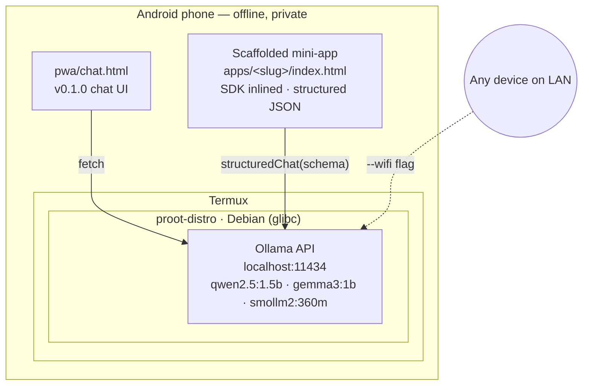

# ollama-pocket

[](https://github.com/s1dd4rth/ollama-pocket/actions/workflows/ci.yml)

**The AI app framework that fits in one phone — offline, private, yours.**

ollama-pocket is a framework for building personalised AI mini-apps that run
entirely on a phone you already own. Scaffold an app in one command, inline a
tiny SDK, talk to a local LLM via structured JSON. No cloud, no account, no
data leaving the device. Your phone becomes a private AI runtime that you
program.

It also ships a one-line installer that turns any old Android phone into a
local AI server using [Ollama](https://ollama.com), [Termux](https://termux.dev),
and a built-in PWA chat UI — the original v0.1.0 use case is unchanged and
still one command away.

[**Read the full guide →**](https://s1dd4rth.github.io/ollama-pocket)

## Quick Start

**In Termux on your phone** — one line:

```bash
curl -fsSL https://s1dd4rth.github.io/ollama-pocket/install.sh | bash
```

That's it. The installer pins a known-good Termux mirror, clones the repo
to `~/ollama-pocket`, installs Debian inside `proot-distro`, installs
Ollama, and copies the PWA chat UI to `/sdcard/ollama-pocket/pwa/`. When
it finishes it prints the exact command to start the server.

Then:

```bash
# Pull a model (pick one that fits your RAM — see table below)
proot-distro login debian -- ollama pull qwen2.5:1.5b

# Start the server + chat UI (opens Chrome at http://localhost:8000/chat.html)
bash ~/ollama-pocket/scripts/start-ollama.sh --wifi --chat
```

**Prefer to inspect before you run?** The `curl | bash` one-liner is
convenient but blindly trusts the install script. If you'd rather read it
first, clone the repo manually:

```bash
pkg install -y git
git clone https://github.com/s1dd4rth/ollama-pocket
cd ollama-pocket
less scripts/install-ollama.sh      # read it
bash scripts/install-ollama.sh      # run it
```

The last command starts Ollama on the LAN, serves the PWA over
`http://localhost:8000`, and launches Chrome pointed at the chat UI. Press
**Ctrl+C** in Termux to stop everything cleanly.

Once the chat UI is open, use Chrome's overflow menu → **Install app** (or
**Add to Home Screen**) to install it as a standalone PWA with real offline
support.

**Optional: debloat your phone first** (requires a PC with ADB to free ~1 GB
of RAM by removing bloatware). Do this **before** the Termux steps above:

```bash
# On your PC, with phone connected via USB and USB debugging enabled
git clone https://github.com/s1dd4rth/ollama-pocket
cd ollama-pocket

# Always start with --dry-run to preview what would be removed on your phone
./scripts/debloat.sh --dry-run

# If it looks sane, run for real
./scripts/debloat.sh

# Or write a JSON report alongside — useful for auditing, or for contributing
# a new vendor list
./scripts/debloat.sh --dry-run --save-report /tmp/debloat.json
```

`debloat.sh` auto-detects your phone's manufacturer via ADB (`LGE`, `Samsung`,
`Xiaomi`, `Google`, …) and loads the matching manifest from `debloat/`. If no
manifest exists for your OEM yet, you'll see a warning — see
[`debloat/README.md`](debloat/README.md) for how to contribute one (usually
one PR, one file). Opt-in category bundles for social apps, preloaded games,
and Google first-party apps load by default; toggle with `--category`,
`--no-categories`, or `--skip-categories google-apps`.

### Two paths, same install

The Quick Start above installs **both** the chat UI and the app scaffolder in
one go. What you do next depends on what you want:

1. **Use your phone as a local AI server** — `bash scripts/start-ollama.sh --wifi --chat`
   opens the built-in chat UI and makes the Ollama API reachable from any
   device on your LAN. This is the v0.1.0 use case and it is unchanged. Skip
   straight to [How It Works](#how-it-works).
2. **Scaffold your own AI mini-app** — `node cli/new.js` walks you through
   creating a self-contained, installable, offline-first AI app under
   `apps/<slug>/`. Everything is inlined (SDK, fonts, styles) so the app is
   one HTML file you can serve with any static HTTP server. Jump to
   [Building Apps](#building-apps) for the full flow and the
   [Spell Bee reference template](examples/spell-bee/).

Both paths run entirely on the phone. Nothing leaves the device unless you
explicitly expose the Ollama port over WiFi.

## Demo

The scaffolded Spell Bee template running on an LG G8 ThinQ — `qwen2.5:1.5b`,
Ollama 0.20.5, offline, installed from the home screen as a real WebAPK. Every
frame below was captured live from a single session on the phone:

| `01` Start | `02` Fetching | `03` Your turn | `04` Judging | `05` Result |
|---|---|---|---|---|
|  |  |  |  |  |

The 5-state FSM (`idle → fetching_word → awaiting_attempt → judging →
showing_feedback → idle`) is driven by two `structuredChat()` calls per round
— one to pick a word+hint, one to grade the attempt — both talking to Ollama
over `localhost:11434` with JSON schemas inlined in the scaffolded app.

## How It Works



Two consumers of the same local Ollama API: the v0.1.0 chat UI and any mini-app scaffolded by `node cli/new.js`. Both are inert HTML files served by Python's `http.server` — nothing proprietary, nothing phoning home.

**Why Debian inside Termux?** Ollama is compiled against glibc. Android (and Alpine Linux) use different C libraries. Debian provides glibc, so Ollama runs natively. No root needed — `proot-distro` fakes root access in userspace.

## What's Included

| File | What it does |
|------|-------------|
| `scripts/debloat.sh` | Vendor-aware ADB debloat. Auto-detects your phone's manufacturer, loads the matching manifest from `debloat/`, and removes preinstalled bloat. Reversible, with `--dry-run` and `--save-report` modes |
| `scripts/install-ollama.sh` | Full install: Termux → proot Debian → Ollama. Run once |
| `scripts/start-ollama.sh` | Start server with `--wifi` and `--chat` flags |
| `scripts/setup-autostart.sh` | Add shell aliases + optional boot-on-start |
| `scripts/bench.sh` | Benchmark your phone's Ollama throughput against a fixed prompt set. Writes a markdown report to `benchmarks/<device-slug>.md`. See [`benchmarks/README.md`](benchmarks/README.md) |
| `debloat/*.txt` | Plain-text package manifests consumed by `debloat.sh`. One file per OEM (`lge.txt`, ...) plus opt-in category bundles (`social.txt`, `games.txt`, `google-apps.txt`). See [`debloat/README.md`](debloat/README.md) for how to add a list for your phone |
| `benchmarks/*.md` | One benchmark report per device, generated by `scripts/bench.sh`. See [`benchmarks/README.md`](benchmarks/README.md) for the contribution workflow |
| `pwa/chat.html` | Standalone chat UI — zero overhead, auto-detects model |
| `pwa/manifest.json` | PWA manifest for "Add to Home Screen" |
| `pwa/sw.js` | Service worker for offline caching |

## Model Recommendations

The speeds below are **measured**, not guessed. Run `scripts/bench.sh` on
your own phone to generate a directly comparable report and submit it to
[`benchmarks/`](benchmarks/) — one PR per device. The fixed prompt set at
[`benchmarks/prompts.json`](benchmarks/prompts.json) means every contributed
benchmark is comparable to every other.

| Model | Download | Speed (measured on Snapdragon 865, LG V60) | Best For |
|-------|----------|---------------------------------------------|----------|
| `qwen2.5:1.5b` | ~1 GB | **7.38 tok/s** warm, 7.28 cold ([report](benchmarks/lge-lm-g850-msmnile-qwen2-5-1-5b.md)) | General chat, reasoning, code |
| `gemma3:1b`    | ~0.8 GB | **9.60 tok/s** warm, 9.58 cold ([report](benchmarks/lge-lm-g850-msmnile-gemma3-1b.md)) | Simple chat, summaries |
| `smollm2:360m` | ~200 MB | **12.72 tok/s** warm, 12.99 cold ([report](benchmarks/lge-lm-g850-msmnile-smollm2-360m.md)) | Quick answers, low RAM devices |

All three numbers are from the same LG V60 ThinQ (Snapdragon 865, 5497 MiB
RAM, Android 12, Ollama 0.20.5, 2 runs each) against the fixed
[`benchmarks/prompts.json`](benchmarks/prompts.json). Run the same bench on
your phone and submit the result — see
[`benchmarks/README.md`](benchmarks/README.md).

> **Rule of thumb:** You need ~2x the model download size in available RAM. A 6GB phone with 2.8GB free can run anything up to ~1.5B parameters comfortably.

## Building Apps

The idea: **personal, agentic AI mini-apps that you write and own**. Not a
chatbot. Not a SaaS. Not another "powered by" integration. You write a small
HTML file, inline a ~20 KB SDK, talk to a local LLM via structured JSON
schemas, and serve it from the phone. The app is a single file. The model
runs on the phone. Your data never leaves the device. You can edit the
template, rescaffold, and the new version is live in seconds.

Every scaffolded app is:

- **A single HTML file** — `index.html` with the SDK inlined as a plain
  `<script>`, per-template CSS inlined as `<style>`, and the per-app config
  inlined as `<script type="application/json" id="app-config">`. Plus
  `manifest.json`, `icon.svg`, `sw.js`, and copies of `pwa/fonts/`. No build
  step. No framework. No npm install.
- **Offline-first** — a network-first service worker caches the app shell
  on first load so the page opens without internet. The LLM itself runs
  locally too, so the whole app works in airplane mode.
- **Installable** — the scaffolded manifest.json + sw.js satisfies the "Add
  to Home Screen" requirements, so you get a real PWA icon in the app
  drawer that opens straight into your app.
- **Agentic** — the SDK's `structuredChat()` uses Ollama's
  grammar-constrained JSON output. Your app talks to the model with a
  schema ("give me `{word, hint, difficulty}`"), not freeform chat. The
  model is a reasoning engine, not a chatbot.
- **Byte-deterministic** — every template has a reference output under
  [`examples/`](examples/) that CI regenerates on every PR. If your edit
  to `sdk/pocket.js` or a template breaks the scaffolder, CI fails loudly
  with a diff.

v0.2.1 ships **one reference template — Spell Bee**, a local spelling game
for kids aged 4–12. It exists to prove the scaffolding works end-to-end on
the structurally hardest template (5-state FSM, two structured-chat calls
per round, bounded sessions, character-level diff highlighting). More
templates land in later releases; [writing your own](CONTRIBUTING.md#adding-a-template)
is ~200 lines.

**Run it on your phone:**

```bash
# 1. Make sure Ollama is running and `qwen2.5:1.5b` is installed
ollama pull qwen2.5:1.5b
bash scripts/start-ollama.sh

# 2. Scaffold an app. Node 18+ built-ins only, zero npm install.
node cli/new.js
# …or non-interactive, for scripts and CI:
node cli/new.js --non-interactive \
  --slug spell-bee-demo \
  --template kids-game/spell-bee \
  --age-group 6-8 \
  --model qwen2.5:1.5b \
  --host http://localhost:11434 \
  --output apps/spell-bee-demo

# 3. Serve it locally and open in Chrome
python3 -m http.server 8000 --directory apps/spell-bee-demo
# Open http://localhost:8000/
```

**Reference output:** [`examples/spell-bee/`](examples/spell-bee/) is the
byte-deterministic scaffold output, regenerated and diff-checked in CI on
every PR so edits to `sdk/pocket.js`, the base template, or the Spell Bee
template never silently break the scaffolder.

**Escape hatch for the inlined SDK:** scaffolded apps have the entire
`sdk/pocket.js` inlined into `<script>` at scaffold time. When the SDK gets
a bug fix, run `node cli/update.js apps/<slug>` to re-inline the new version
into an existing app without losing the embedded `app-config`.

Writing a new template is documented in
[`CONTRIBUTING.md`](CONTRIBUTING.md#adding-a-template).

## Requirements

- Android phone (arm64, 4GB+ RAM recommended)
- PC with [ADB](https://developer.android.com/tools/adb) installed (for debloat + initial setup)
- USB cable
- [Termux](https://f-droid.org/en/packages/com.termux/) from F-Droid (**not** Play Store — that version is outdated)

## Troubleshooting

| Problem | Fix |
|---------|-----|
| `ollama: command not found` | PATH issue. Use full path: `/usr/local/bin/ollama serve` |
| Model download fails / OOM | Your model is too big. Try `smollm2:360m` |
| `GLIBC not found` / musl error | You're running Ollama outside Debian. Use `proot-distro login debian` first |
| ADB path mangling on Git Bash | Use double-slash: `adb push file //sdcard/` |
| Connection refused in chat UI | Ollama server isn't running. Start it first with `start-ollama.sh` |
| Termux from Play Store crashes | Uninstall, reinstall from [F-Droid](https://f-droid.org/en/packages/com.termux/) |
| `PWA server did not respond on port 8000` | Another process is using port 8000. Kill it (`pkill -f "http.server 8000"`) or edit `PWA_PORT` in `scripts/start-ollama.sh` |
| `Could not launch Chrome automatically` | Chrome isn't installed or is disabled. Install Chrome from the Play Store, or open `http://localhost:8000/chat.html` manually in any Chromium-based browser. Firefox and Samsung Internet are not currently supported. |
| Fonts look like Courier/Arial fallback | Service worker install failed on first load (flaky network during install). Close Chrome, reopen, reload once. The fonts are shipped locally in `pwa/fonts/` so they'll cache on a successful load. |
| `pkg update` fails with `Clearsigned file isn't valid, got 'NOSPLIT'` or similar mirror errors | Termux auto-picked a broken mirror. The installer now pins `packages-cf.termux.dev` before running `pkg update` to avoid this, but if you ran `pkg update` manually *before* the installer, the broken mirror may still be in your sources.list. Fix: `echo 'deb https://packages-cf.termux.dev/apt/termux-main/ stable main' > $PREFIX/etc/apt/sources.list && pkg update` |

## Use It As an API Server

Once running with `--wifi`, any device on your network can use the Ollama API:

```bash
# From any PC/phone on the same WiFi
curl http://<phone-ip>:11434/api/generate \
  -d '{"model":"qwen2.5:1.5b","prompt":"Hello!"}'

# Works with any OpenAI-compatible client
# API Base: http://<phone-ip>:11434/v1
# Model:    qwen2.5:1.5b
```

Compatible with Open WebUI, Continue (VS Code), Chatbox, and anything that speaks the Ollama or OpenAI API.

## Contributing

PRs welcome. Especially interested in:

- Testing on other phones/SoCs (MediaTek, Exynos, Tensor)
- Debloat lists for Samsung, Xiaomi, Pixel
- Performance benchmarks on different devices
- Better PWA features (chat export, model switching, system prompts)

## License

MIT
